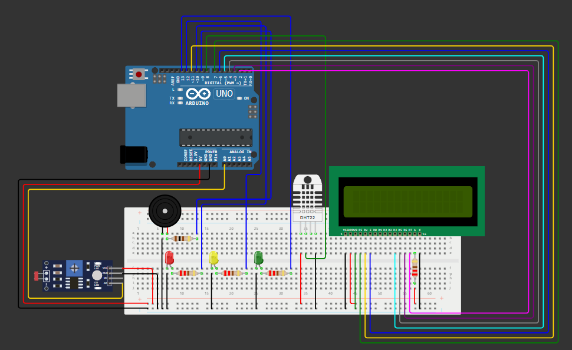

# Checkpoint-02---O-Caso-da-Vinheria-Agnello

Projeto desenvolvido como parte da atividade de Edge Computing e Computer Systems na <a href="">FIAP</a> ministrada pelo professor <a href="https://www.linkedin.com/in/fabio-cabrini?miniProfileUrn=urn%3Ali%3Afs_miniProfile%3AACoAAA4IttQBKDdr5cvPzUTzpVSkZFkQM-qKngk&lipi=urn%3Ali%3Apage%3Ad_flagship3_search_srp_all%3B3UXPOnpXR6qTOU9g%2FnseBQ%3D%3D" target="_blank">Fábio Cabrini</a>.

Este projeto consiste em um sistema de alarme desenvolvido na plataforma Wokwi para monitorar a luminosidade, temperatura e umidade do ambiente de uma vinheria. O objetivo é oferecer uma solução simples e eficaz para a vinheria (empresa fictícia) que deseja ampliar seu mercado através do serviço de delivery de vinhos.

<strong>Link do circuíto no Wokwi: <a href="https://wokwi.com/projects/396235203544314881">Checkpoint 02 - O Caso da Vinheria Agnello</a></strong>

<h2>Integrantes: </h2>
<ol>
  <li>
    
João Victor Soave

    
  </li>
  <li>
    
Felipe Nascimento

    
  </li>
    <li>
    
Henrique Ignacio

    
  </li>
    <li>
    
Gustavo

    
  </li>
</ol>

<h2>Contexto e Descrição do Desafio</h2>

Vocês foram contratados pela Vinheria Agnello para desenvolver um sistema de monitoramento a ser instalado 
no ambiente em que os vinhos são armazenados. O dono a Vinheria informou que a qualidade do vinho é 
influenciada diretamente pelas condições de temperatura, umidade e luminosidade do ambiente.

### Fatores que podem influenciar a qualidade do vinho

#### Luminosidade:
A iluminação deve ser muito suave. Os vinhos agradecem lugares com penumbra, especialmente os brancos e espumantes, que sofrem mais com o contato com a luz. Raios ultravioletas, por exemplo, causam alterações nos compostos orgânicos, iniciando reações químicas que podem gerar resultados desagradáveis.

#### Temperatura:
O calor excessivo rapidamente termina com a vida do vinho e as flutuações térmicas de mais de 3°C podem causar o aparecimento de aromas indesejados. A situação perfeita seria que ficassem constantemente sob uma temperatura de cerca de 13°C (segundo estudo de Alexander Pandell, PhD, Universidade da Califórnia).

#### Umidade:
A falta de umidade pode levar, por exemplo, ao ressecamento do vedante, provocando uma má vedação da garrafa, com risco de oxidação do líquido. Já o excesso de umidade pode danificar os rótulos, bem como promover a proliferação de fungos. O ideal é que seja próxima a 70% (com variação em torno de 60% a 80%).

### Principais Requisitos

1. Enquanto o ambiente estiver escuro, o LED Verde deve ficar aceso;
2. Enquanto o ambiente estiver a meia luz, o LED amarelo deve ficar aceso e mensagem de "Ambiente a meia luz" deve ser mostrado no Display;
3. Enquanto o ambiente estiver totalmente iluminado, o LED vermelho deve ficar aceso e a mensagem "Ambiente muito claro" deve ser mostrado no display;
4. Enquanto o ambiente estiver totalmente iluminado, o Buzzer deve ficar ligado continuamente;
5. Enquanto o ambiente estiver com uma temperatura entre 10°C e 15°C, o Display deve informar "Temperatura OK" e também mostrar o valor da temperatura;
6. Enquanto o ambiente estiver com uma umidade entre 50% e 70%, o Display deve informar "Umidade OK", e também mostrar o valor da umidade;
7. Os valores apresentados no display devem ser a média de pelo menos 5 leituras dos sensores, e os valores devem ser apresentados a cada 5 segundos;
8. Enquanto a temperatura estiver fora da faixa ideal, o LED Amarelo deve ficar aceso e o Buzzer deve ligar continuamente;
9. Enquanto a temperatura estiver fora da faixa ideal, o Display deve informar "Temperatura Alta", para valores acima de 15°C e também mostrar a temperatura;
10. Enquanto a temperatura estiver fora da faixa ideal, o Display deve informar "Temperatura Baixa", para valores abaixo de 10°C e também mostrar a temperatura;
11. Enquanto a umidade estiver fora da faixa ideal, o LED Vermelho deve ficar aceso e o Buzzer deve ligar continuamente;
12. Enquanto a umidade estiver fora da faixa ideal, o Display deve informar "Umidade Alta", para valores acima de 70% e também mostrar a umidade;
13. Enquanto a umidade estiver fora da faixa ideal, o Display deve informar "Umidade Baixa", para valores abaixo de 50% e também mostrar a umidade;
14. Obrigatório o uso da função map() para os valores de luminosidade;
15. Os valores devem ser medidos durante 10 ciclos de execução, após esses ciclos apresentar os valores médios;
16. Apresentar o logo animado da equipe no Display durante a inicialização do equipamento.

<h2>Descrição: </h2>

O sistema de alarme é composto por um Arduino, um sensor de luminosidade (LDR), três LEDs, um buzzer, um sensor DHT22 e um Display. O Arduino monitora continuamente a luminosidade ambiente usando o sensor de luminosidade. O nível de luminosidade é mostrado através dos LEDs, considerando que o nível ideal de luminosidade para o armazenamento de vinhos é baixo (abaixo de 30%). Em caso de níveis de luminosidade de alerta (entre 30% e 60%), o LED amarelo será aceso e caso o nível seja crítico (acima de 60%) será aceso o LED vermelho e o buzzer emitirá um som de perigo durante 3 segundos. Paralelamente

Paralelamente, o Arduino monitora a temperatura e umidade do ambiente através do sensor DHT22 e indica no display as informações captadas. Caso a temperatura ou a umidade ultrapasse ou retroceda o nível ideal, será indicado no display e o buzzer tocará continuamente

## Dependências

- **Wokwi**: Plataforma de simulação de hardware que permite prototipar circuitos eletrônicos e sistemas embarcados online.
- **Componentes Virtuais**: Sensores virtuais de luminosidade, temperatura e umidade, LEDs e buzzer disponíveis na plataforma Wokwi.

## Como Reproduzir

1. Acesse o [Wokwi](https://wokwi.com/).
2. Abra o projeto "Checkpoint 02 - O Caso da Vinheria Agnello" (ou crie um novo projeto).
3. Adicione os componentes virtuais de sensor de luminosidade, temperatura e umidade ao projeto.
4. Conecte os componentes de acordo com o diagrama do circuito.
5. Carregue o código do Arduino que realiza a leitura dos sensores e simula o controle das condições ideais para armazenamento de vinhos.
6. Execute a simulação para observar o comportamento do sistema.

## Funcionalidades

- Leitura em tempo real da luminosidade, temperatura e umidade do ambiente.
- Simulação de controle para manter as condições ideais de armazenamento de vinhos.
- Visualização dos dados de monitoramento em um display virtual.

<!-- <h2>Funcionamento: </h2>

Luminosidade OK: 

Luminosidade Alerta: 

Luminosidade Perigo: 

Código no Tinkercad

Registro Serial: 

 -->

